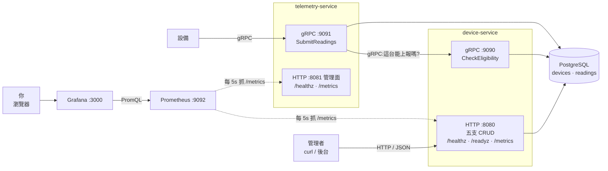
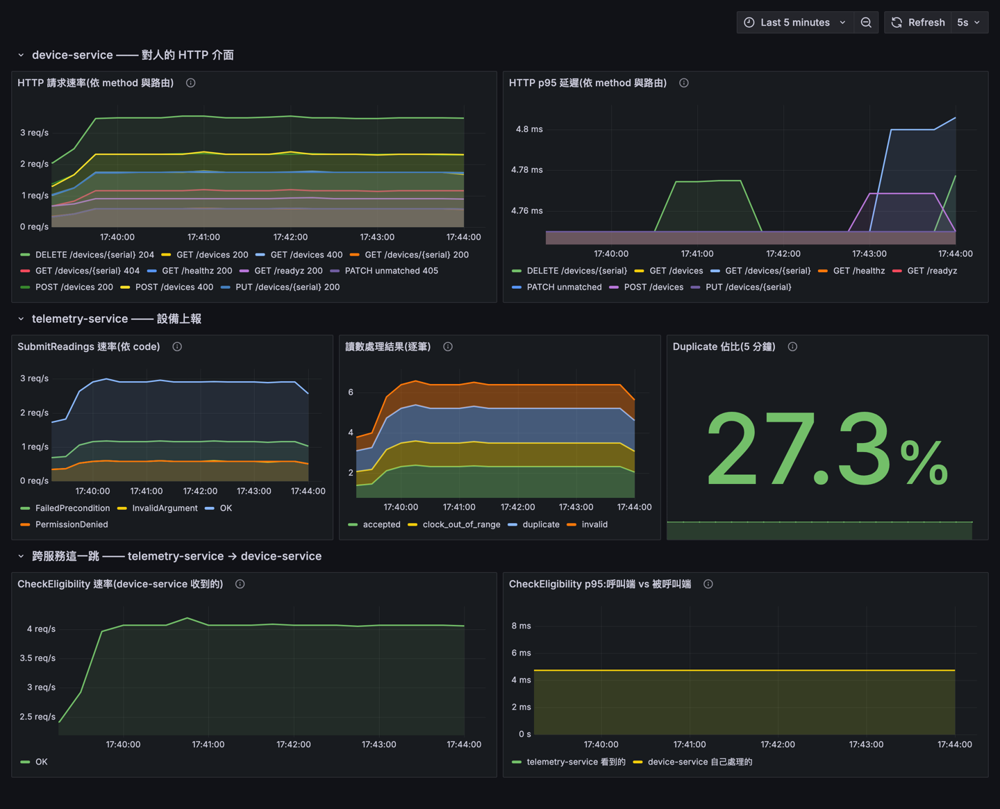
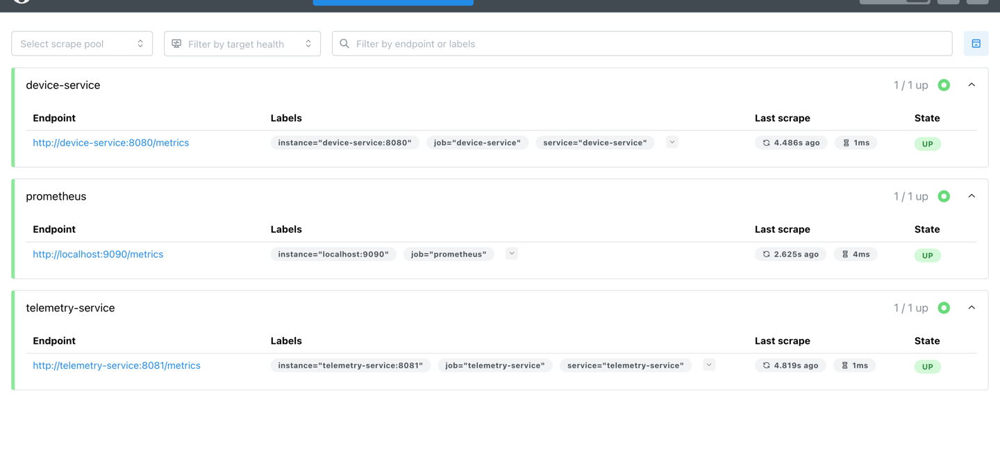

# device-telemetry-go

設備遙測平台 —— 以 Go 實作的微服務練習專案。

溫度計、濕度計這類設備會定期把量到的數值傳回平台。**device-service** 管理設備的身分與啟用狀態,**telemetry-service** 收下這些數值(專案裡稱為 Reading),並在寫入前向 device-service 確認這台設備有沒有資格上報。

重點不在功能多寡,而在三件事:**服務間通訊**(HTTP 與 gRPC 各用在對的地方)、**錯誤處理**(哪些是答案、哪些是失敗),以及**重送情境下的寫入冪等性**(設備會重試,平台不能因此長出重複資料)。

能用標準庫的就用標準庫:路由是 `net/http`、日誌是 `log/slog`。第三方只有標準庫沒有的那幾樣 —— `pgx` 連資料庫、`grpc` 做服務間通訊、`prometheus/client_golang` 出指標。沒有 web 框架、沒有 ORM、沒有 DI 容器。

---

## 架構



虛線是**抓取**的方向。Prometheus 主動去拿,服務只是把數字放在 `/metrics` 上等人來拿 —— 它們完全不知道 Prometheus 存在。

| 元件 | 負責什麼 |
|---|---|
| **device-service** | 設備的 CRUD(對人開 HTTP)、回答「這台能不能上報」(對服務開 gRPC) |
| **telemetry-service** | 收下設備上報的 Reading,寫入前先問 device-service |
| **PostgreSQL** | 兩張表:`devices` 與 `readings` |
| **Prometheus** | 每 5 秒去兩個服務的 `/metrics` 抓一次,存成時序資料 |
| **Grafana** | 用 PromQL 查 Prometheus,畫成儀表板 |

為什麼業務介面這樣分、每個服務內部怎麼分層,見 [docs/design.md](./docs/design.md)。

### 技術選擇

| 選擇 | 理由 |
|---|---|
| `net/http`(Go 1.22 ServeMux) | 內建就支援 `GET /devices/{serial}` 這類路由,一般 CRUD 不需要 gin/chi |
| `pgx` + 手寫 SQL | 不用 ORM。型別看得見、query 控制得住,效能問題查得出來 |
| gRPC + `buf` | 服務間的契約寫在 `.proto`,兩端程式碼從同一份產生。buf 取代 protoc:設定寫在檔案裡而非一長串參數,還附帶 lint 與相容性檢查 |
| `log/slog` | 標準庫的結構化日誌,不需要第三方 logger |
| `prometheus/client_golang` | 指標是標準庫沒有的東西。用原生 client 而非 OpenTelemetry:少一層抽象與一個 collector 元件 |
| 分三層 + interface 定義在使用端 | 領域層不知道 HTTP 也不知道 SQL,可以完全不碰資料庫做測試。見 [design.md](./docs/design.md) |

---

## 快速開始

需要 **Go 1.26+** 與 **Docker**。

想看監控就直接跳到[監控](#監控),`make up` 一行把全部起起來。以下是開發時的跑法 —— 兩個服務各開一個終端機(`run-*` 會自己先把資料庫起來):

```bash
make run-device      # HTTP :8080 / gRPC :9090
```

```bash
make run-telemetry   # gRPC :9091,會去問 device-service
```

第三個終端機:

```bash
# 註冊一台設備
curl -s -X POST localhost:8080/devices \
  -H 'Content-Type: application/json' \
  -d '{"serial":"SN-0001","name":"一樓溫度計","location":"1F"}' | jq

# 再送一次 —— 註冊是冪等的,現有的名字不會被蓋掉
curl -s -X POST localhost:8080/devices \
  -H 'Content-Type: application/json' \
  -d '{"serial":"SN-0001","name":"想蓋掉的名字"}' | jq

curl -s localhost:8080/devices | jq
```

設備上報走 gRPC:

```bash
grpcurl -plaintext -d '{
  "serial": "SN-0001",
  "readings": [{"recordedAt":"2026-08-29T10:00:00Z","metric":"temperature","value":21.5}]
}' localhost:9091 telemetry.v1.TelemetryService/SubmitReadings
```

送第二次同樣的內容,回應會從 `ACCEPTED` 變成 `DUPLICATE` —— 讀數的寫入也是冪等的。

### API

#### device-service

**HTTP `:8080`** —— 設備管理的 CRUD(人用 `curl` 或後台打),加上探活與指標。

| Method | Path | 說明 |
|---|---|---|
| `POST` | `/devices` | 註冊設備,**冪等** |
| `GET` | `/devices` | 列出設備(`?limit=&offset=`) |
| `GET` | `/devices/{serial}` | 取得單一設備 |
| `PUT` | `/devices/{serial}` | 更新 `name` / `location` / `enabled` |
| `DELETE` | `/devices/{serial}` | 刪除設備與其讀數,**冪等** |
| `GET` | `/healthz` | liveness:process 還活著 |
| `GET` | `/readyz` | readiness:會實際 ping 資料庫 |
| `GET` | `/metrics` | Prometheus 指標 |

**gRPC `:9090`** —— 只有一支,給 telemetry-service 在寫入前查資格用。

| Method | 說明 |
|---|---|
| `device.v1.DeviceService/CheckEligibility` | 這台設備能不能上報 |

#### telemetry-service

**gRPC `:9091`** —— 設備上報的入口,也是這個服務唯一的業務介面。

| Method | 說明 |
|---|---|
| `telemetry.v1.TelemetryService/SubmitReadings` | 批次上報,逐筆回結果 |

**HTTP `:8081`** —— 管理面。指標與探活走 HTTP,所以純 gRPC 的服務仍然要開一個 HTTP port,這是常態而不是將就。

| Method | Path | 說明 |
|---|---|---|
| `GET` | `/healthz` | liveness:process 還活著 |
| `GET` | `/metrics` | Prometheus 指標 |

---

## 監控

兩個指令,各開一個終端機:

```bash
make up      # 起全部五個服務(第一次要 build,會等一下)
make load    # 持續打流量 —— 沒有流量的話圖上就是一條平的零
```

收工用 `make down`。資料會留著,下次 `make up` 還在;要清空是 `make reset`。

### Grafana:看圖

<http://localhost:3000/d/device-telemetry/device-telemetry>

免登入。也可以從 <http://localhost:3000> 進去,左側選單的 **Dashboards** 底下只有一張叫 **Device Telemetry**。



七張圖,依服務分成三組 —— 混在一起看不出誰是誰。

**device-service —— 對人的 HTTP 介面**

請求速率與 p95 延遲,都依 **method 與 route** 分。`GET /devices`(列表)與 `POST /devices`(註冊)是兩件完全不同的事,合在一起看沒有意義。route 用的是路由樣板,所以 `/devices/SN-0001` 與 `/devices/SN-0002` 仍算同一條線;打不到任何路由的請求(截圖裡的 `PATCH unmatched 405`)則一律歸為 `unmatched`。

**telemetry-service —— 設備上報**

`SubmitReadings` 的錯誤碼分布,加上兩張這個平台才有的:

- **讀數處理結果** 與 **Duplicate 佔比** —— 冪等機制實際擋下多少重送。截圖裡是 27.3%,因為 `make load` 會反覆送同一批讀數。設備重試越積極這個數字越高,而這件事本來只能翻 log 才知道。
- 注意 gRPC 的 `OK` 與逐筆結果是兩層:整批被收下(`OK`)之後,個別讀數仍可能是 `duplicate` 或被拒。錯誤碼那張看的是前者,讀數處理結果看的是後者。

**跨服務這一跳**

同一個 `CheckEligibility`,在呼叫端與被呼叫端各量一次。兩條線的差距就是網路與排隊的成本,能分辨「下游慢」還是「中間慢」。(本機跑的話兩條會疊在一起 —— 延遲太低,落在同一個 histogram 桶裡。)

`make load` 用的是現成的 smoke script,裡面本來就會刻意打出未註冊、已停用、時鐘跑掉這些案例,所以錯誤碼的分布和 duplicate 的比例自然就有東西看。

### Prometheus:確認資料真的有進來

<http://localhost:9092>,上方選單的 **Status → Target health**。



**Target** 就是「Prometheus 要去抓指標的一個位址」。這一頁列出它現在盯著的每一個,以及最近一次抓取的結果:

- **`UP`** —— 上一次抓成功了。三個都該是 UP:`device-service`、`telemetry-service`,還有 Prometheus 自己(它也產生自己的指標)。
- **`DOWN`** —— 抓不到,旁邊會直接寫原因(連線被拒、逾時、404)。
- **Last scrape** —— 距離上次抓取多久。設定是每 5 秒一次,所以這個數字應該一直在 0~5 秒之間跳。

**圖是空的時候,先看這一頁。**它能分辨兩種完全不同的狀況:target 是 `DOWN`(服務沒起來或位址寫錯),還是 target 是 `UP` 但圖仍然空的(抓得到,只是沒有流量 —— 那就去跑 `make load`)。

指標清單、label 的設計、Prometheus 與 Grafana 的設定怎麼運作,見 [design.md 的可觀測性](./docs/design.md#七可觀測性)。


---

## 開發與測試

`make help` 會列出所有指令。

| 指令 | 做什麼 |
|---|---|
| `make up` / `make down` | 用容器起 / 關全部五個服務(兩個服務、PostgreSQL、Prometheus、Grafana) |
| `make db` | 只起 PostgreSQL —— `make run-*` 會自己先跑這個 |
| `make run-device` / `make run-telemetry` | 在本機用 `go run` 跑服務(各開一個終端機) |
| `make load` | 持續打流量餵儀表板 |
| `make test` | 單元測試(不需要資料庫,約兩秒) |
| `make test-int` | 整合測試(testcontainers 自己起資料庫) |
| `make lint` | `go vet` + `gofmt` 檢查 |
| `make reset` | 砍掉全部 volume 重新來過(改了 `migrations/` 之後要跑) |
| `make proto` | 改了 `.proto` 之後重新產生 Go 程式碼 |

### 兩種跑法,不能同時用

| | 服務跑在哪 | 適合 |
|---|---|---|
| `make run-device` / `make run-telemetry` | 本機(`go run`) | 寫程式。改完 Ctrl-C 再跑,幾秒鐘的事 |
| `make up` | 容器 | 看監控。Prometheus 在容器網路裡才找得到服務 |

兩者都會佔用 8080 / 9090 / 9091,同時起會撞 port。

### 四種測試,各自抓不同的東西

| 種類 | 指令 | 需要 | 抓得到什麼 |
|---|---|---|---|
| 單元 | `make test` | 無 | 業務邏輯。用假的 Repository,完全不碰資料庫 |
| 整合 | `make test-int` | Docker | SQL 本身:欄位順序、錯誤碼轉換、交易語意 |
| smoke | `make smoke-device-http` | device-service | HTTP 整條鏈 |
| smoke | `make smoke-device-grpc` | device-service + `grpcurl` | gRPC 整條鏈 |
| smoke | `make smoke-telemetry-grpc` | 兩個服務 + `grpcurl` | 跨服務的上報流程 |

三支 smoke test 會自己斷言結果,全過 `exit 0`、任一項失敗 `exit 1`,而且只碰自己建立的測試資料。裡面每個呼叫上方都附了**可以直接複製執行的 `curl` / `grpcurl`**,想手動重現某一項時很方便。

服務沒起來時它們會直接 `exit 2` 並告訴你該跑哪個指令,不會跑完整套再噴一整面紅字 —— 那樣真正的原因會被埋在裡面。

整合測試靠 [testcontainers](https://golang.testcontainers.org/) 起一個乾淨的 PostgreSQL,並且**用 `migrations/001_init.sql` 建 schema** —— 所以它同時也是 migration 的回歸測試。想改成對著 `make db` 起來的資料庫跑(快一點)就設 `DATABASE_URL`。

### 改 `.proto` 才需要的工具

`gen/` 底下產生好的程式碼已經進版控,所以**單純建置、跑測試、build image 都不用裝這些**:

```bash
brew install buf grpcurl
go install google.golang.org/protobuf/cmd/protoc-gen-go@latest
go install google.golang.org/grpc/cmd/protoc-gen-go-grpc@latest
```

改完跑 `make proto`。送出前用 `make proto-breaking` 確認沒有破壞相容性 —— `.proto` 的**欄位編號**才是線上格式的識別碼,改欄位名是安全的,重用編號不是。

---

## 專案結構

```
cmd/                  每個子目錄編成一個執行檔
  device-service/       HTTP + gRPC 雙 server
  telemetry-service/    gRPC server,同時是 device-service 的 client
  healthcheck/          給 docker healthcheck 用的小工具(最終 image 裡沒有 curl)

internal/             只有這個 module 能 import —— Go 編譯器層級的限制,不只是慣例
  device/               【領域】設備的型別、業務錯誤、Service
  telemetry/            【領域】讀數的型別、能不能上報的判斷規則、Service
  store/                【儲存】唯一知道 SQL 長什麼樣的地方
  httpapi/              【傳輸】HTTP handler 與 middleware
  grpcapi/              【傳輸】gRPC server 實作與 interceptor
  deviceclient/         【傳輸】device-service 的 gRPC client
  reqid/                request ID 在 context 裡的唯一存放處
  metrics/              Prometheus 指標在這個 process 裡的唯一存放處

proto/                服務間契約的唯一來源
gen/                  由 proto/ 產生,不要手改(下次 make proto 會覆蓋)
migrations/           資料庫 schema,docker-compose 在首次啟動時執行
scripts/              端到端 smoke test
deploy/               Prometheus 設定與 Grafana 的 provisioning
docs/images/          README 用的截圖
docs/adr/             關鍵設計決策與它們的理由
```

---

## 延伸閱讀

| 文件 | 內容 |
|---|---|
| **[CONTEXT.md](./CONTEXT.md)** | 領域詞彙 —— 什麼叫 Device、Reading、Enabled,以及**不要用**哪些詞 |
| **[docs/design.md](./docs/design.md)** | 分層、依賴方向、錯誤怎麼跨層傳遞、冪等性怎麼實作。從上面那張架構圖逐層展開 |
| [ADR-0001](./docs/adr/0001-serial-as-natural-key.md) | 用出廠序號當主鍵,不另外產生 UUID |
| [ADR-0002](./docs/adr/0002-device-clock-as-dedup-key.md) | 用設備的時鐘做去重依據 |
| [ADR-0003](./docs/adr/0003-application-level-delete.md) | 刪除在應用層的交易裡做,不用 `ON DELETE CASCADE` |
