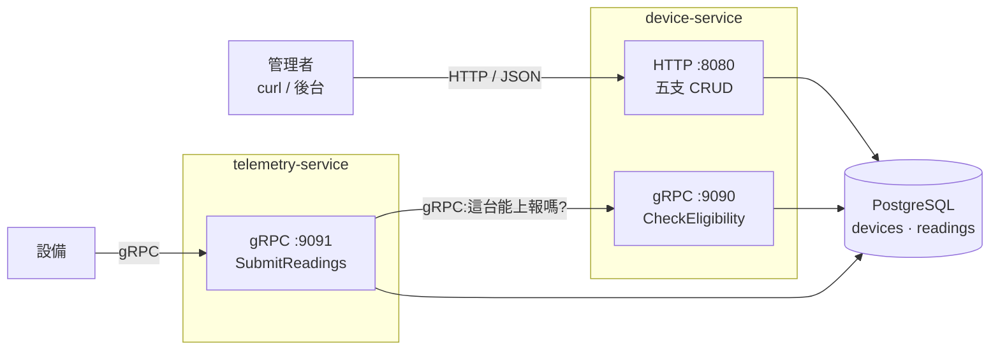

# device-telemetry-go

設備遙測平台 —— 以 Go 實作的微服務練習專案。

溫度計、濕度計這類設備會定期把量到的數值傳回平台。**device-service** 管理設備的身分
與啟用狀態,**telemetry-service** 收下這些數值(專案裡稱為 Reading),並在寫入前向
device-service 確認這台設備有沒有資格上報。

重點不在功能多寡,而在三件事:**服務間通訊**(HTTP 與 gRPC 各用在對的地方)、
**錯誤處理**(哪些是答案、哪些是失敗),以及**重送情境下的寫入冪等性**
(設備會重試,平台不能因此長出重複資料)。

用到的東西幾乎都是標準庫,加上三個套件:`net/http`、`log/slog`、`pgx`、`grpc`、
`prometheus/client_golang`。沒有 web 框架、沒有 ORM、沒有 DI 容器。

---

## 架構



| 元件 | 負責什麼 |
|---|---|
| **device-service** | 設備的 CRUD(對人開 HTTP)、回答「這台能不能上報」(對服務開 gRPC) |
| **telemetry-service** | 收下設備上報的 Reading,寫入前先問 device-service |
| **PostgreSQL** | 兩張表:`devices` 與 `readings` |

對人的介面用 HTTP、服務之間用 gRPC。為什麼這樣分、每個服務內部怎麼分層,見
[docs/design.md](./docs/design.md)。

### 技術選擇

| 選擇 | 理由 |
|---|---|
| `net/http`(Go 1.22 ServeMux) | 內建就支援 `GET /devices/{serial}` 這類路由,一般 CRUD 不需要 gin/chi |
| `pgx` + 手寫 SQL | 不用 ORM。型別看得見、query 控制得住,效能問題查得出來 |
| gRPC + `buf` | 服務間的契約寫在 `.proto`,兩端程式碼從同一份產生。buf 取代 protoc:設定寫在檔案裡而非一長串參數,還附帶 lint 與相容性檢查 |
| `log/slog` | 標準庫的結構化日誌,不需要第三方 logger |
| `prometheus/client_golang` | 指標是標準庫沒有的東西。用原生 client 而非 OpenTelemetry:少一層抽象與一個 collector 元件 |
| 分三層 + interface 定義在使用端 | 領域層不知道 HTTP 也不知道 SQL,可以完全不碰資料庫做測試。見 [design.md](./docs/design.md) |

---

## 快速開始

需要 **Go 1.26+** 與 **Docker**。

兩個服務各開一個終端機(`run-*` 會自己先把資料庫起來):

```bash
make run-device      # HTTP :8080 / gRPC :9090
```

```bash
make run-telemetry   # gRPC :9091,會去問 device-service
```

第三個終端機:

```bash
# 註冊一台設備
curl -s -X POST localhost:8080/devices \
  -H 'Content-Type: application/json' \
  -d '{"serial":"SN-0001","name":"一樓溫度計","location":"1F"}' | jq

# 再送一次 —— 註冊是冪等的,現有的名字不會被蓋掉
curl -s -X POST localhost:8080/devices \
  -H 'Content-Type: application/json' \
  -d '{"serial":"SN-0001","name":"想蓋掉的名字"}' | jq

curl -s localhost:8080/devices | jq
```

設備上報走 gRPC:

```bash
grpcurl -plaintext -d '{
  "serial": "SN-0001",
  "readings": [{"recordedAt":"2026-08-29T10:00:00Z","metric":"temperature","value":21.5}]
}' localhost:9091 telemetry.v1.TelemetryService/SubmitReadings
```

送第二次同樣的內容,回應會從 `ACCEPTED` 變成 `DUPLICATE` —— 讀數的寫入也是冪等的。

### API

| Method | Path | 說明 |
|---|---|---|
| `GET` | `/healthz` | liveness:process 還活著 |
| `GET` | `/readyz` | readiness:會實際 ping 資料庫 |
| `GET` | `/metrics` | Prometheus 指標 |
| `POST` | `/devices` | 註冊設備,**冪等** |
| `GET` | `/devices` | 列出設備(`?limit=&offset=`) |
| `GET` | `/devices/{serial}` | 取得單一設備 |
| `PUT` | `/devices/{serial}` | 更新 `name` / `location` / `enabled` |
| `DELETE` | `/devices/{serial}` | 刪除設備與其讀數,**冪等** |

| gRPC method | 說明 |
|---|---|
| `device.v1.DeviceService/CheckEligibility` | 這台設備能不能上報 |
| `telemetry.v1.TelemetryService/SubmitReadings` | 批次上報,逐筆回結果 |

telemetry-service 對外只有 gRPC,但指標與探活走 HTTP,所以它另外開一個管理面
(預設 `:8081`),上面有 `/metrics` 與 `/healthz`。

---

## 開發與測試

`make help` 會列出所有指令。

| 指令 | 做什麼 |
|---|---|
| `make up` / `make down` | 起 / 關 PostgreSQL |
| `make run-device` / `make run-telemetry` | 本機跑兩個服務(各開一個終端機) |
| `make test` | 單元測試(不需要資料庫,約兩秒) |
| `make test-int` | 整合測試(testcontainers 自己起資料庫) |
| `make lint` | `go vet` + `gofmt` 檢查 |
| `make db-reset` | 砍掉 DB volume 重建(改了 `migrations/` 之後要跑) |
| `make proto` | 改了 `.proto` 之後重新產生 Go 程式碼 |

### 四種測試,各自抓不同的東西

| 種類 | 指令 | 需要 | 抓得到什麼 |
|---|---|---|---|
| 單元 | `make test` | 無 | 業務邏輯。用假的 Repository,完全不碰資料庫 |
| 整合 | `make test-int` | Docker | SQL 本身:欄位順序、錯誤碼轉換、交易語意 |
| smoke | `make smoke-device-http` | 服務在跑 | HTTP 整條鏈 |
| smoke | `make smoke-device-grpc` | + `grpcurl` | gRPC 整條鏈 |
| smoke | `make smoke-telemetry-grpc` | 兩個服務都在跑 | 跨服務的上報流程 |

三支 smoke test 會自己斷言結果,全過 `exit 0`、任一項失敗 `exit 1`,而且只碰自己建立的
測試資料。裡面每個呼叫上方都附了**可以直接複製執行的 `curl` / `grpcurl`**,想手動
重現某一項時很方便。

整合測試靠 [testcontainers](https://golang.testcontainers.org/) 起一個乾淨的 PostgreSQL,
並且**用 `migrations/001_init.sql` 建 schema** —— 所以它同時也是 migration 的回歸測試。
想改成對著 `make up` 起來的資料庫跑(快一點)就設 `DATABASE_URL`。

### 改 `.proto` 才需要的工具

`gen/` 底下產生好的程式碼已經進版控,所以**單純建置、跑測試、build image 都不用裝這些**:

```bash
brew install buf grpcurl
go install google.golang.org/protobuf/cmd/protoc-gen-go@latest
go install google.golang.org/grpc/cmd/protoc-gen-go-grpc@latest
```

改完跑 `make proto`。送出前用 `make proto-breaking` 確認沒有破壞相容性 ——
`.proto` 的**欄位編號**才是線上格式的識別碼,改欄位名是安全的,重用編號不是。

---

## 專案結構

```
cmd/                  每個子目錄編成一個執行檔
  device-service/       HTTP + gRPC 雙 server
  telemetry-service/    gRPC server,同時是 device-service 的 client
  healthcheck/          給 docker healthcheck 用的小工具(最終 image 裡沒有 curl)

internal/             只有這個 module 能 import —— Go 編譯器層級的限制,不只是慣例
  device/               【領域】設備的型別、業務錯誤、Service
  telemetry/            【領域】讀數的型別、能不能上報的判斷規則、Service
  store/                【儲存】唯一知道 SQL 長什麼樣的地方
  httpapi/              【傳輸】HTTP handler 與 middleware
  grpcapi/              【傳輸】gRPC server 實作與 interceptor
  deviceclient/         【傳輸】device-service 的 gRPC client
  reqid/                request ID 在 context 裡的唯一存放處

proto/                服務間契約的唯一來源
gen/                  由 proto/ 產生,不要手改(下次 make proto 會覆蓋)
migrations/           資料庫 schema,docker-compose 在首次啟動時執行
scripts/              端到端 smoke test
docs/adr/             關鍵設計決策與它們的理由
```

---

## 延伸閱讀

| 文件 | 內容 |
|---|---|
| **[CONTEXT.md](./CONTEXT.md)** | 領域詞彙 —— 什麼叫 Device、Reading、Enabled,以及**不要用**哪些詞 |
| **[docs/design.md](./docs/design.md)** | 分層、依賴方向、錯誤怎麼跨層傳遞、冪等性怎麼實作。從上面那張架構圖逐層展開 |
| [ADR-0001](./docs/adr/0001-serial-as-natural-key.md) | 用出廠序號當主鍵,不另外產生 UUID |
| [ADR-0002](./docs/adr/0002-device-clock-as-dedup-key.md) | 用設備的時鐘做去重依據 |
| [ADR-0003](./docs/adr/0003-application-level-delete.md) | 刪除在應用層的交易裡做,不用 `ON DELETE CASCADE` |
